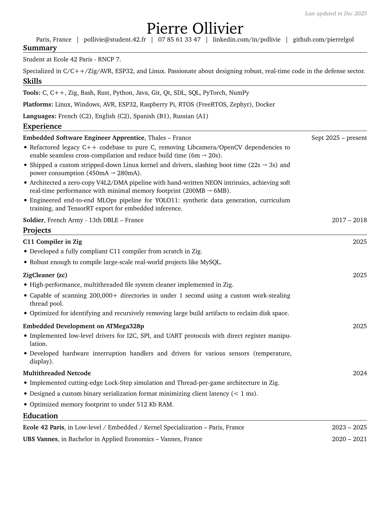

# Pierre Ollivier - Embedded Software Engineer

This repository contains the source code and build artifacts for my professional resume, generated using [RenderCV](https://github.com/rendercv/rendercv).

## Resume Preview



## Downloads

*   **English Version:** [PDF](rendercv_output/Pierre_Ollivier_CV_EN.pdf)
*   **French Version:** [PDF](rendercv_output/Pierre_Ollivier_CV_FR.pdf)

## Building from Source

The resume is defined in YAML and rendered to PDF/HTML/Markdown.

### Prerequisites

*   Python 3.10+
*   `make` (optional, for convenience)

### Build Commands

1.  **Install dependencies:**
    ```bash
    make install
    ```

2.  **Build both versions:**
    ```bash
    make all
    ```

    Or build individually:
    ```bash
    make english
    make french
    ```

3.  **Clean up:**
    ```bash
    make clean
    ```

## Project Structure

*   `Pierre_Ollivier_CV_EN.yaml`: Configuration for the English resume.
*   `Pierre_Ollivier_CV_FR.yaml`: Configuration for the French resume.
*   `rendercv_output/`: Generated output files (PDFs, PNGs, etc.).
